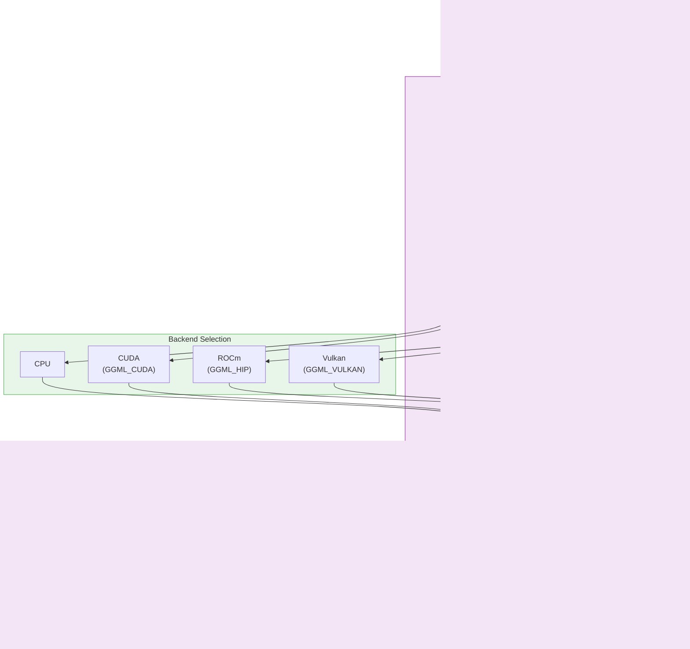

# llama-builds

> CI/CD build registry for llama.cpp — automated builds, validation, and publishing for upstream and community forks.

[](https://github.com/Heretek-AI/llama-builds/actions/workflows/pre-commit.yml)
[](https://github.com/Heretek-AI/llama-builds/actions/workflows/super-linter.yml)
[](https://sonarcloud.io/dashboard?id=Heretek-AI_llama-builds)
[](https://github.com/Heretek-AI/llama-builds/releases)

---

## Why llama-builds?

Building llama.cpp from source is complex — multiple backends (CPU, CUDA, ROCm, Vulkan), architecture variants, GPU targets, and per-fork build differences. **llama-builds** eliminates this complexity with a single GitHub Action and a validated manifest registry.

| What you get | How it works |
|--------------|--------------|
| **Drop-in GitHub Action** | `uses: heretek/build-llama@v1` — 3 required inputs, builds any CMake-based fork |
| **Multi-backend support** | CPU, CUDA, ROCm, Vulkan — one action, all backends |
| **Dynamic build matrix** | Auto-discovers targets from `targets/*/build.sh` — no hardcoded matrices |
| **Schema-validated manifests** | JSON Schema v3 with 30+ fields per target, bidirectional consistency checks |
| **Traceable versioning** | Every build tagged `{upstream_ref}-{build_num}` (e.g. `abc1234-3`) |
| **Automated releases** | Sequential tags, GitHub Releases with artifacts, GitHub Pages manifest |

---

## Quick Start

### Use as a GitHub Action

```yaml
- uses: heretek/build-llama@v1
  id: build
  with:
    repo: ggml-org/llama.cpp
    ref: ${{ github.sha }}
    backend: cpu  # cpu | cuda | rocm | vulkan
```

**Outputs:** `artifact_path`, `manifest_entry`, `resolved_sha`, `version_tag`

### Generate Manifest Locally

```bash
python -m scripts.generate_manifest
python -m scripts.audit_matrix
```

### Run Tests

```bash
pytest tests/ -v
```

---

## Build Targets

| Target | Repo | Backend | Capabilities | Status |
|--------|------|---------|--------------|--------|
| `upstream-cpu` | ggml-org/llama.cpp | cpu | chat, embed | active |
| `upstream-cuda` | ggml-org/llama.cpp | cuda | chat, embed, flash-attn | active |
| `upstream-rocm` | ggml-org/llama.cpp | rocm | chat, embed | active |
| `upstream-vulkan` | ggml-org/llama.cpp | vulkan | chat, embed | active |
| `ik-llama-cpp` | ikawrakow/ik_llama.cpp | cpu | chat, embed, iq_k, trellis | active |
| `ik-llama-cpp-cuda` | ikawrakow/ik_llama.cpp | cuda | chat, embed, iq_k, trellis | active |
| `llama-cpp-dgx` | croll83/llama.cpp-dgx | cuda | chat, embed, dgx-spark | deprecated |

**Adding a new target:** Copy `targets/_template/build.sh`, fill in the `METADATA` header, and submit a PR.

---

## CUDA Builds

We provide pre-built CUDA binaries for common GPU architectures:

| Build | SM | GPUs | Notes |
|-------|-----|------|-------|
| `upstream-cuda` | universal | All CUDA GPUs | PTX fallback, works everywhere |
| `upstream-cuda-sm80` | sm_80 | A100, A30 | Optimized for datacenter Ampere |
| `upstream-cuda-sm86` | sm_86 | RTX 30xx, A10 | Optimized for consumer Ampere |
| `upstream-cuda-sm89` | sm_89 | RTX 40xx, L4, L40S | Optimized for Ada Lovelace |
| `upstream-cuda-sm90` | sm_90 | H100, H200 | Optimized for Hopper |

The universal build uses llama.cpp's default `CMAKE_CUDA_ARCHITECTURES`,
which compiles for all supported architectures via PTX fallback. This means
one binary works on any CUDA GPU, but may have JIT overhead on first run.

SM-specific builds are optimized for exact architectures, avoiding JIT
overhead and producing smaller binaries.

---

## Quick Install

Install pre-built binaries with `llamaup`:

```bash
curl -sSL https://heretek-ai.github.io/llama-builds/llamaup | bash
```

This will:
1. Auto-detect your GPU
2. Download the right binary for your architecture
3. Install to `~/.local/bin`

### Options

```bash
llamaup --list              # See available builds
llamaup --dry-run           # Preview what would be installed
llamaup --version abc1234-1 # Install specific version
```

---

## How It Works



**Two-tier architecture:**
- **Tier 1 (Core):** Composite action for CMake-based builds (~15 issues)
- **Tier 2 (Adapters):** Standalone actions for Python wheels, OCI images, WASM, docs (~13 issues)

---

## Manifest Schema

The manifest (`manifest.json`) is validated against a JSON Schema with 30+ fields per target:

```json
{
  "version": 3,
  "generated_at": "2026-08-02T21:55:40.735291+00:00",
  "targets": {
    "upstream-cpu": {
      "name": "llama.cpp upstream CPU baseline",
      "repo": "ggml-org/llama.cpp",
      "ref": "0ab9d6fed73dbc5dc8026c868cb10a6728c4ed48",
      "backend": "cpu",
      "arch": "x86_64",
      "capabilities": ["chat", "embed"],
      "version": "0ab9d6f-1",
      "build": {
        "runner": "ubuntu-latest",
        "script": "targets/upstream-cpu/build.sh",
        "os": "ubuntu",
        "artifact": "llama-0ab9d6f-1-ubuntu-cpu-x86_64.tar.gz"
      }
    }
  }
}
```

**Key v3 fields:** `gpu_toolchain`, `layer`, `parent`, `ci_capable`, `is_llama_cpp_fork`, `smoke_test`, `upstream_ref`, `status`.

---

## CI/CD Pipeline

| Workflow | Trigger | Purpose |
|----------|---------|---------|
| `build.yml` | workflow_call/dispatch | Main build pipeline |
| `matrix.yml` | pull_request/dispatch | Dynamic target discovery + matrix build |
| `release.yml` | workflow_run | Automated GitHub Release (sequential tags) |
| `manifest-pages.yml` | tag push (v*) | Publish manifest to GitHub Pages |
| `upstream-watch.yml` | every 6 hours | Detect upstream llama.cpp changes |
| `fork-health.yml` | weekly | Audit fork repos for staleness |
| `hardware-day.yml` | manual dispatch | On-demand GPU builds |
| `pre-commit.yml` | pull_request/push | Pre-commit hook validation |
| `super-linter.yml` | pull_request/push | GitHub Super Linter |
| `sonarcloud.yml` | pull_request/push | SonarCloud code quality |
| `codeql-analysis.yml` | pull_request/push | CodeQL security analysis |

**Required checks on `main`:** pre-commit, super-linter, sonarcloud, gitleaks.

---

## Repository Structure

```
llama-builds/
├── action.yml                 # Composite GitHub Action
├── targets/                   # Build targets (METADATA headers)
│   ├── _template/             # Template for new targets
│   ├── upstream-cpu/
│   ├── upstream-cuda/
│   ├── upstream-rocm/
│   └── upstream-vulkan/
├── scripts/                   # CI tooling
│   ├── generate_manifest.py
│   ├── audit_matrix.py
│   ├── generate_matrix.py
│   └── ...
├── schemas/                   # JSON Schema definitions
├── tests/                     # 111 test functions
├── docs/                      # Design specs, runbooks
└── .github/workflows/         # 11 CI/CD workflows
```

---

## Contributing

See [CONTRIBUTING.md](CONTRIBUTING.md) for branch naming, commit conventions, and PR requirements.

**Quick reference:**
- Branch: `feat/<scope>`, `fix/<scope>`, `chore/<scope>`
- Commits: Conventional Commits
- PRs: Linked Issue required (`Closes #<id>`)

---

## License

[MIT](LICENSE)
